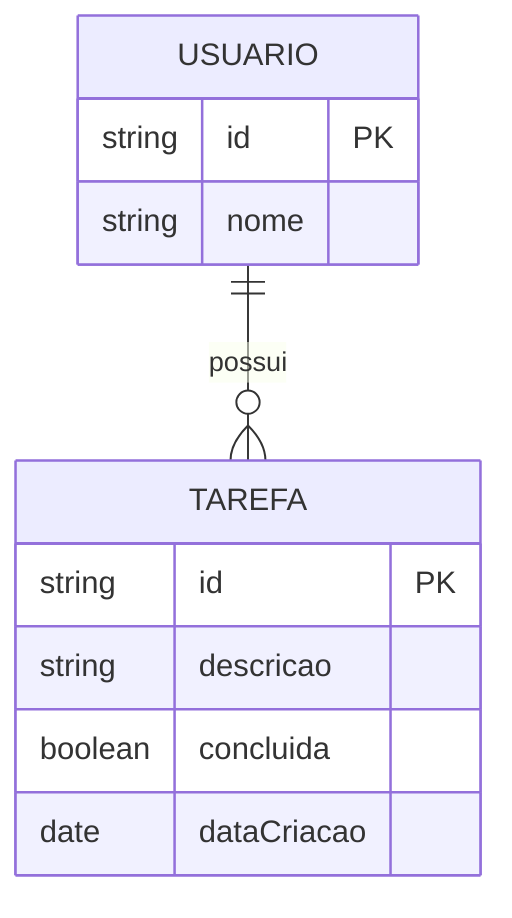

## Especificações Técnicas

### Framework CSS
- Nome: Bootstrap
- Versão: 5.3.2
- Fonte: https://getbootstrap.com/

### API Pública
- Nome: OpenWeather API
- Versão: 2.5 (Current Weather API)
- Fonte: https://api.openweathermap.org
