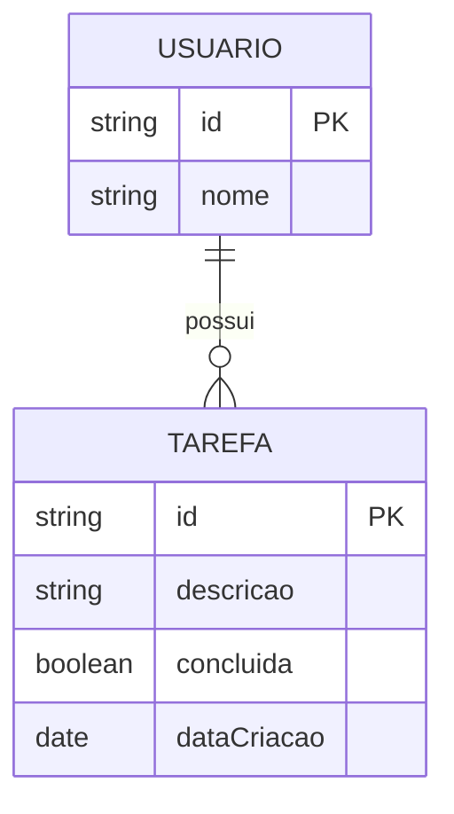

```mermaid
erDiagram
    USUARIO ||--o{ TAREFA : possui

    USUARIO {
        string id PK
        string nome
    }

    TAREFA {
        string id PK
        string descricao
        boolean concluida
        date dataCriacao
    }
```
